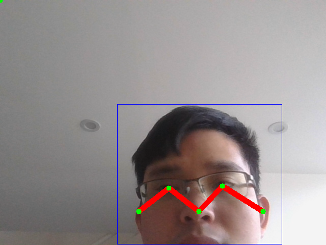

# Human-Keypoints-Detection

## 1.目录结构

```
├── configs
├── data
├── demo
├── libs
├── models
├── README.md
├── requirements.txt
├── utils
└── demo.py

```

## 2. Train

- 目前只提供推理代码,训练代码暂时不开放

## 3.Test

- 测试可视化效果
- python demo.py
- 修改`demo.py`代码，可实现不同的关键点检测
```python
    # 自定义MPII上半身6个关键点
    hp = PoseEstimation(config=val_config.body_mpii_192_256, device="cuda:0")
    # COCO共17个关键点
    # hp = PoseEstimation(config=val_config.person_coco_192_256, device="cuda:0")
    # 自定义COCO上半身11个关键点
    # hp = PoseEstimation(config=val_config.body_coco_192_256, device="cuda:0")
    image_dir = "data/test_images"
    hp.detect_image_dir(image_dir, detect_person=True, waitKey=0)
```

## C++版本
目前，已将该仓库python，使用C++实现，支持如下功能：
- 支持Linux，Android，Windows系统
- 支持Android CPU和GPU运行(OpenCL加速)，轻量化模型在手机上可实时运行，亲测麒麟980测试30ms左右
- 升级可支持RK芯片NPU(如RK1808 RV1109/RV1126)
- 提供人体(person)检测模型，包括C++版本


