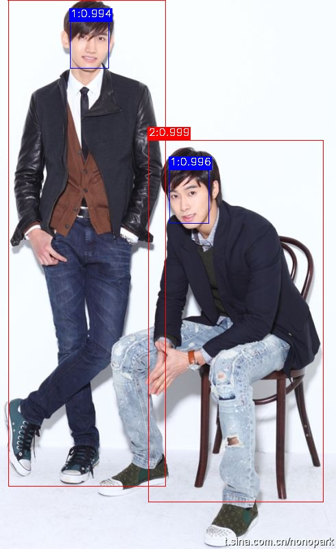

# human-detector-ssd
基于UltraFace的人脸+人体检测器
- github: https://github.com/Linzaer/Ultra-Light-Fast-Generic-Face-Detector-1MB

## 1. 目录结构

```
.
├── data                       # 相关数据
│   ├── pretrained             # 模型权重文件
│   └── test_images            # 测试图片
├── nets                       # 模型
├── utils                      # 工具包      
├── md5sum.txt                 # md5sum文件
├── requirements.txt           
├── demo.py                    # Demo文件
├── test.jpg                   # 测试图片
├── result.jpg
└── README.md
```

## 2. Platform
- hardware: Intel Core i7-8700 CPU @ 3.20GHz × 12, GPU GeForce RTX 2070 8G
- Python3.6
- Pillow-6.0
- Pytorch-1.5.0
- torchvision-0.6.0
- numpy-1.16.3
- opencv-python 3.4.1


## 3. 模型输入/输出
- 模型输入:  输入`RGB image`,大小可任意,模型默认[width,height]=[640, 360]
- 模型输出:  输出分数scores:shape=(1, num_bboxes, num_class),框boxes:shape=(1, num_bboxes, 4),经NMS后处理后为boxes, labels, probs

```
class_names=class_names = ["BACKGROUND", "face", "person"],num_class=3 
index=0 表示背景,
index=1 表示face,
index=2 表示person,
boxes=[xmin,ymin,xmax,ymax]
```
- 推荐iou_threshold=0.3
- 推荐prob_threshold=0.65

## 4. Run a demo
#### (1)Pytorch版本

```bash
python demo.py \
    --model_path "data/pretrained/pth/mode-face-person-640-360.pth" \
    --priors_type "face_person" \
    --input_size 640 360 \
    --image_dir test.jpg  
```

- 输出:

```
boxes:[[2.4788077e+02 2.4794414e+02 3.0439163e+02 3.2593839e+02]
 [1.0256265e+02 3.1609463e+01 1.5849120e+02 9.9273170e+01]
 [1.2078496e+01 3.0961037e-01 2.4132016e+02 7.0879242e+02]
 [2.1671794e+02 2.0456519e+02 4.7117340e+02 7.3192352e+02]]
labels:[1 1 2 2]
probs:[0.9969098 0.9947121 0.9999722 0.9990758]
```

#### (2)ONNX版本
- input_name:['input']
- output_name:['scores', 'boxes']

```bash
python demo_onnx.py \
    --model_path "data/pretrained/onnx/mode-face-person-640-360.onnx" \
    --priors_type "face_person" \
    --input_size 640 360 \
    --image_dir test.jpg  
```

- 输出:

```
boxes:[[2.4788078e+02 2.4794417e+02 3.0439160e+02 3.2593842e+02]
 [1.0256265e+02 3.1609478e+01 1.5849120e+02 9.9273178e+01]
 [1.2078489e+01 3.0946732e-01 2.4132013e+02 7.0879248e+02]
 [2.1671786e+02 2.0456519e+02 4.7117340e+02 7.3192352e+02]]
labels:[1 1 2 2]
probs:[0.9969099  0.99471223 0.9999722  0.9990758 ]

```


- 可视化结果




## 5. 测试结果

> https://wiki.dm-ai.cn/pages/viewpage.action?pageId=141883428

|Test|mAP|
|:-----:|-----|
|MPII|face: 0.91212, person: 0.94025,mAP: 0.92618|
|COCO|face: 0.65278, person: 0.60769,mAP: 0.630235|
