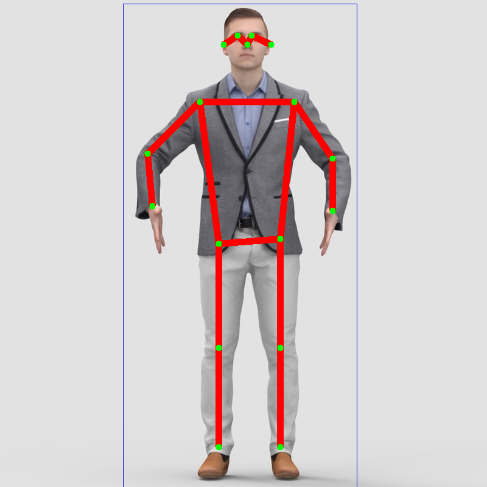

# Human-Keypoints-Detection

## 1.目录结构

```
├── configs                # 模型配置文件
├── models                 # 模型文件
├── data                   # 数据
├── demo                   # demo文件
├── libs                   # 第三方库文件
├── utils                  # 工具包
├── README.md              # 说明文件
├── requirements.txt       #
└── demo.py                # demo测试文件
```

## 2. 使用教程

#### (1) 环境安装

```bash
# 先安装Anaconda3
# 在conda新建虚拟环境pytorch-py36(如果已经存在，则无需新建)
conda create -n pytorch-py36 python==3.6.7
# 激活虚拟环境pytorch-py36(每次运行都需要运行)
conda activate  pytorch-py36
# 安装工程依赖的包(如果已经安装，则无需安装)
pip install -r requirements.txt
```

#### (2) 工程使用

- 进行图片测试: 把需要测试的图片("*.jpg", "*.png")放在data/test_images目录下
```bash
conda activate  pytorch-py36
python run.py --image_file data/test_images
```

- 进行视频测试

```bash
conda activate  pytorch-py36
python run.py --video_file data/videos/kunkun_cut.mp4
```

- 进行摄像头测试，--video_file 0表示摄像头ID号

```bash
conda activate  pytorch-py36
python run.py --video_file 0
```

